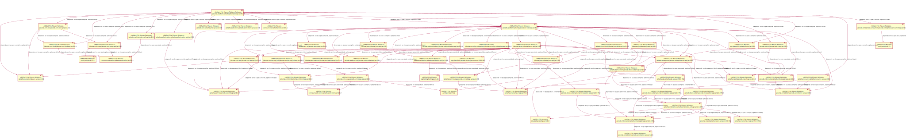

= Jakarta EE Dependency Analysis With jQAssistant

== Overview

This project provides a setup to scan Maven Central repository for Jakarta EE artifacts and provide GraphML and PlantUML/SVG reports about dependencies of the involved specifications:

TIP: See link:example[here] for further example reports.

== Requirements

* Java Development Kit 11 or later (17+ recommended)
* Maven 3.5.x or later

== How To Use It

* Clone the project
* Execute the following command
+
----
mvn verify
----
+
NOTE: The first scan fetches the full index from Maven Central, this will take time.
* After analysis the following reports are created in the folder `target/jqassistant/report`:
** `plantuml/jakarta-ee-dependencies_PlatformDependencyDiagram.plantuml|svg`: The artifacts and their dependencies as PlantUML component diagram.
** `graphml/jakarta-ee-dependencies_PlatformDependencyDiagram.graphml`:  The artifacts and their dependencies as GraphML file.
** `plantuml/jakarta-ee-dependencies_SpecificationDependencyDiagram.plantuml|svg`: The dependencies grouped by specification as PlantUML component diagram.
** `graphml/jakarta-ee-dependencies_SpecificationDependencyDiagram.graphml`: The dependencies grouped by specification as GraphML file.
+
TIP: GraphML reports may be viewed using https://www.yworks.com/en/products/yfiles/yed/[yEd]. After opening a file you should apply a layout, e.g. `Layout->Hierarchical` (Alt-Shift-H) and property mapping (`Edit->Properties Mapper`) for nodes should be set to use `fqn` or `name` as `Label Text`.
  +
An Open Source alternative is https://gephi.org/[Gephi]. After opening the file `Show Node label(s)` must be activated in the tool palette at the bottom and `fqn` or `name` selected in `Attributes` to be displayed as node label.
** `csv/jakarta-ee-dependencies_PlatformDependencyVersionsByArtifact.csv`: The dependencies as CSV collection all versions grouped by groupId and artifactId.

TIP: The reports are created using Cypher queries and implemented as jQAssistant rules which are located in link:jqassistant/jakarta-ee-dependencies.xml[].

== Known Issues

* The scan and queries used for analysis might be expensive. If an OutOfMemoryError is reported then the heap size for Maven should be set using the environment variable, e.g. `MAVEN_OPTS=-Xmx16G`.
